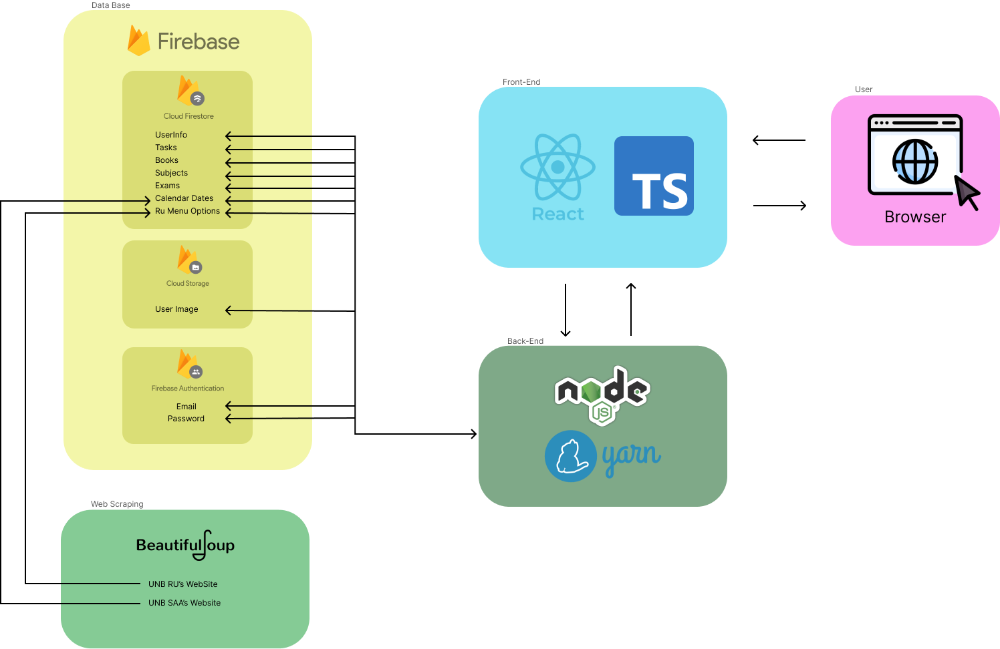

# Arquitetura do Projeto

## Visão Geral

A plataforma de desenvolvimento para estudantes da Universidade de Brasília (UnB) é projetada para oferecer uma experiência integrada e eficiente. A arquitetura do projeto é composta por várias camadas, cada uma desempenhando um papel específico no funcionamento da plataforma.

## Componentes Principais

### 1. Frontend

O frontend da plataforma é responsável pela interface com o usuário. É desenvolvido utilizando tecnologias web modernas, como o JavaScript, com o framework ReactJS. Ele se comunica com o backend por meio da API Firestore para acessar e exibir os dados. Além de, utilizar bibliotecas para a criação de componentes para a melhora da usabilidade do usuário na plataforma.

### 2. Backend

O backend é a espinha dorsal da plataforma, lidando com a lógica de negócios e o armazenamento de dados. Utiliza o Firebase para autenticação de usuários e armazenamento de dados em tempo real, além de, usar a biblioteca NodeJS para a instalação de novas dependências para facilitar o desenvolvimento da plataforma.

### 3. Banco de Dados

O banco de dados é utilizado para armazenar informações essenciais da plataforma, como dados dos usuários, cardápio da cafeteria e eventos do calendário acadêmico. No caso deste projeto, o Firebase fornece um banco de dados NoSQL altamente escalável e de baixa latência.

### 4. Serviços Externos

Além dos componentes principais, a plataforma integra-se com serviços externos, a partir de uma ferramenta de web scraping que coleta informações dos sites oficiais da UnB, como o calendário acadêmico e cardápio semanal do restaurante universitário que são exibidos no nosso site.

## Fluxo de Dados

O fluxo de dados na plataforma segue um padrão de solicitação e resposta:

1. O usuário interage com a interface do usuário (frontend), realizando ações como fazer login, visualizar o cardápio ou acessar o calendário acadêmico.
2. O frontend envia solicitações para o backend por meio da API do Firebase Firestore.
3. O backend (Firestore) processa as solicitações, acessa os dados necessários no banco de dados e realiza as operações solicitadas.
4. O backend retorna os dados solicitados ao frontend, que os exibe na interface do usuário para o usuário final.

## Considerações de Segurança

A segurança é uma preocupação fundamental na arquitetura do projeto. As seguintes medidas são implementadas para garantir a segurança dos dados e dos usuários:

- Autenticação de usuários por meio do Firebase Authentication para garantir que apenas usuários autorizados tenham acesso à plataforma.
- Autorização baseada em funções para controlar as permissões dos usuários e restringir o acesso a recursos específicos com base no papel do usuário.
- Implementação de práticas recomendadas de segurança, como proteção contra ataques de injeção de SQL e XSS (Cross-Site Scripting), para evitar vulnerabilidades de segurança.

## Conclusão

A arquitetura do projeto é projetada para oferecer uma plataforma robusta, escalável e segura para os estudantes da UnB. Com componentes bem definidos e uma abordagem centrada no usuário, estamos confiantes de que nossa plataforma atenderá às necessidades dos usuários e proporcionará uma experiência excepcional.
